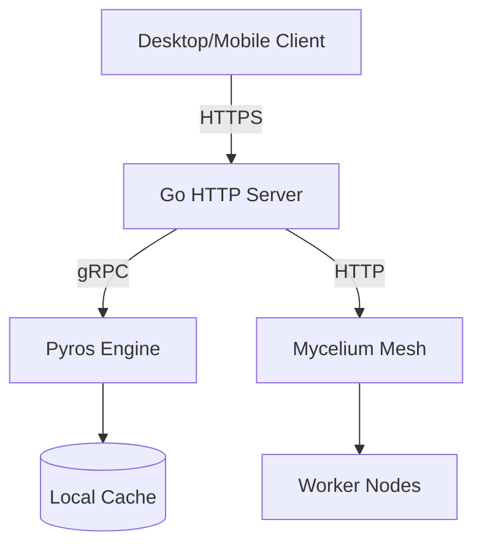
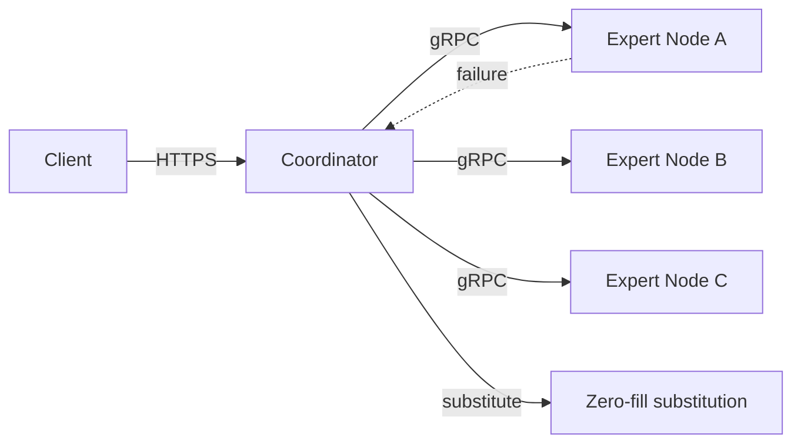

# Thornveil Repository Standards

The bar every repo on `github.com/thornveil-ai` is held to. Whether someone lands on the smallest internal repo or the most-pinned public one, the experience should feel like one company's work, at one quality level, with one voice.

This document is the source of truth. When something here conflicts with a per-repo README, the README is wrong. When a new system joins the org, this is the checklist.

---

## Contents

- [1. Principles](#1-principles)
- [2. Voice and tone](#2-voice-and-tone)
- [3. Required files](#3-required-files)
- [4. README structure](#4-readme-structure)
- [5. Visibility tiers and license posture](#5-visibility-tiers-and-license-posture)
- [6. CHANGELOG format](#6-changelog-format)
- [7. Branch protection by tier](#7-branch-protection-by-tier)
- [8. CODEOWNERS pattern](#8-codeowners-pattern)
- [9. Diagrams](#9-diagrams)
- [10. GitHub repo settings](#10-github-repo-settings)
- [11. Releases and supply chain](#11-releases-and-supply-chain)
- [12. Quality bar — examples](#12-quality-bar--examples)
- [13. Adding a new system](#13-adding-a-new-system)
- [14. Auditing existing repos against this standard](#14-auditing-existing-repos-against-this-standard)

---

## 1. Principles

These principles are non-negotiable. Everything below derives from them.

1. **Verifiable claims only.** Don't say "blazing fast," say "0.31 ms overhead per call (benchmark at `docs/PERF.md`)." If you can't link the number, don't say the number.
2. **Honest framing.** A research prototype is a research prototype. A Phase 0 system is a Phase 0 system. A v1.0 production release is a v1.0 production release. Saying anything else burns trust the first time a customer runs the code.
3. **Engineering-first.** Lead with what it does and how it works. Marketing belongs on `thornveil.ai`, not in repo READMEs.
4. **Sovereignty-forward.** Thornveil systems run locally, on user hardware, with user data. Lead with that posture where applicable. Don't celebrate cloud dependencies.
5. **Terse.** Every sentence earns its place. If a section's purpose is "look how much we wrote," delete it.
6. **No hype.** No exclamation marks. No "revolutionary." No "game-changing." No emoji in repo content. The work speaks; the README explains.
7. **Same shape, every repo.** A reader who knows the layout of one Thornveil repo can navigate any other without re-learning.

---

## 2. Voice and tone

### Do

- Present indicative: "Pyros runs locally" (not "Pyros will run" / "Pyros aims to run")
- Active voice: "The router classifies the request" (not "Requests are classified")
- Specific numbers with sources: "1.13M parameters, 82.12% mAP@50 on AntiUAV-410"
- Acknowledge limits: "Phase 0 — mesh exists, decision engine not yet wired"
- Link to the file when you reference internals: `internal/mesh/expert.go`
- Match terminology to the code: if the code says `expert`, the README says `expert`, not "worker" or "node" interchangeably

### Don't

- Emoji in repo content (READMEs, CHANGELOGs, code comments, commit messages). The frontend can use icons; repos stay text-only.
- Exclamation marks
- "We" / "our" in marketing-flavored contexts. Use "Thornveil" or describe the system as the subject ("Mycelium routes...").
- AI/LLM attribution in commits, code, files, or PRs ("Generated by Claude," "AI-assisted," etc.). Zero tolerance.
- Patent markers in repos (THRN-XXXX numbers, "patent pending," etc.). Patents are tracked in business filings, not surfaced in repo content.
- Customer names without explicit written permission. SOCPAC, named units, classified customers — never in public artifacts. Always coordinate before any inclusion in private artifacts.
- Forward-looking marketing language ("Soon will support..." / "Coming in v2..."). If it doesn't ship, it doesn't go in the README.
- Comparison-by-name to competitors unless you can defend the comparison line-by-line. "Faster than OpenAI" is a lawsuit risk. "Runs locally; OpenAI doesn't" is a fact.

---

## 3. Required files

Every migrated repo on `github.com/thornveil-ai` has these files at the listed paths. Each one is verifiable via `gh api`.

| Path | Required | Purpose |
|---|---|---|
| `README.md` | Always | Front door. Conforms to Section 4. |
| `LICENSE` | Always | Per visibility tier (Section 5). |
| `CHANGELOG.md` | Always | Section 6 format. Even minimal — `## [Unreleased]` is allowed for new repos. |
| `.gitignore` | Always | Language-appropriate. No tracked build artifacts, ever. |
| `.github/CODEOWNERS` | Always | Section 8 pattern. |
| `.github/workflows/label-sync.yml` | Always | Caller workflow that delegates to `thornveil-ai/.github`. |
| `SECURITY.md` | Always | Either real content or one-line: `See [org SECURITY policy](https://github.com/thornveil-ai/.github/blob/main/SECURITY.md).` |
| `CONTRIBUTING.md` | Tier 1 only | Real contribution guide for public OSS. Private repos omit; CODEOWNERS routes review. |
| `docs/ARCHITECTURE.md` | If non-trivial arch | Cross-component data flow. Mermaid diagrams. |
| `docs/PRINCIPLES.md` | If strong design ethos | Why the system is shaped the way it is. |
| `docs/RUNBOOK.md` | If operational footprint | Boot, monitor, recover. |

Files explicitly **not** required (and absent unless you have a specific reason):

- `CODE_OF_CONDUCT.md` (inherited from org default)
- `FUNDING.yml` (Tier 1 only, opt-in)
- `ROADMAP.md` (lives in MIGRATION_CATALOG.md + GitHub Projects, not in repo content)

---

## 4. README structure

The canonical structure. Every README on the org follows this shape. Order matters; section names match exactly.

````markdown
# <System Name>

> **<Visibility tier>. <Maturity phase>.** <One sentence on what state it's in.>

<badge row — see Section 4.2>

<Tagline paragraph: 2-3 sentences. What it does. Why it exists. Nothing else.>

## Quick Start

```bash
<5 commands max, copy-pasteable, get to a running system>
```

## Architecture

<One paragraph. Then a Mermaid diagram.>

```mermaid
<block or sequence diagram>
```

<If detail belongs elsewhere, link to docs/ARCHITECTURE.md.>

## License

<Tier + 1-sentence note. Link to LICENSE.>

---

A Thornveil system. See [other Thornveil systems](https://github.com/thornveil-ai).
````

### 4.1 Title and status callout

The title is the system name, no decoration: `# Pyros`, not `# Pyros — the self-sustaining inference engine`.

The status callout is a blockquote, lives directly under the title, and states two things in one line:

- **Visibility tier** — `Public OSS`, `Marketing-public, source-private`, `Private`, `Export-controlled (EAR ECCN 4D004)`
- **Maturity phase** — `v1.0 production`, `v0.x research-prototype`, `Phase 0 — in development`, `Internal-only`

Examples:

```
> **Public OSS. v0.1.4 production.** Apache-2.0 capability-based safety gate for LLM agents.

> **Private. v1.0 production — customer-deployed.** Distributed AI mesh for inference across heterogeneous nodes.

> **Private. Phase 0 — in active development.** Multi-modal counter-UAS situational awareness. Most layers scaffolded, mesh and decision engine not yet wired into the main binary.
```

### 4.2 Badge row

Shields.io badges, no decoration around them, one row, left-aligned. Standard order:

1. **License** — `[](LICENSE)` (or `proprietary`)
2. **Version** — `[](https://github.com/thornveil-ai/<repo>/releases)` (or PyPI badge for Python)
3. **Build** — `[](https://github.com/thornveil-ai/<repo>/actions)`
4. **Tests** — only if a public test count is meaningful: `[](tests/)`
5. **Coverage** — only if there's a real coverage source; skip if you'd be making it up.

For private repos that won't expose CI: omit build + tests badges. License + Version is enough.

For Tier 3 (Auspex): no badges. Single-page minimal README.

### 4.3 Tagline paragraph

2-3 sentences. Answers two questions:

1. What does the system do?
2. Why does it exist (what's the alternative-it-replaces or the problem-it-solves)?

No metaphors. No quotes. No "imagine if..." setups.

Example (Mycelium):
> Mycelium is a distributed AI mesh that lets a Gemma-4-26B-class model run sharded across heterogeneous nodes (workstation, laptops, ruggedized tablets) with substitute-on-failure inference. Designed for DDIL environments where any individual node may drop and the workload must continue without operator action.

### 4.4 Quick Start

Five commands maximum. Each command does one thing. Together they take a fresh reader from nothing to a running system or a passing test.

Format as a single fenced code block, not multiple. Use `bash` syntax highlighting.

```bash
# Install
pip install signet-sign

# Verify install
signet --version

# Run a check
echo "hello" | signet check
```

No prose between commands. If something needs explaining, it doesn't belong in Quick Start.

### 4.5 Architecture section

One paragraph + Mermaid diagram. The paragraph names the major components and their responsibilities. The diagram shows how they connect.

If the system has substantive depth (multi-component, custom protocols, non-obvious data flow), the README architecture section says "Overview only — full architecture in [docs/ARCHITECTURE.md](docs/ARCHITECTURE.md)" and the real doc lives there.

Mermaid only for diagrams (Section 9). No PNGs. No SVGs. No ASCII art (Mermaid renders + is source-controlled; ASCII art rots).

### 4.6 License section

One paragraph, one link. Form:

```markdown
## License

Apache-2.0. See [LICENSE](LICENSE). Patents that read on this work are tracked separately by Thornveil LLC and a royalty-free license to use them is granted under the terms of the Apache-2.0 license above.
```

For proprietary:

```markdown
## License

Proprietary. See [LICENSE](LICENSE). Internal use within Thornveil LLC only. Contact `legal@thornveil.ai` for any external licensing inquiry.
```

For Tier 3 (Auspex):

```markdown
## License

Proprietary, export-controlled (EAR ECCN 4D004). See [LICENSE](LICENSE) and [EXPORT_CONTROLS.md](EXPORT_CONTROLS.md). All access gated by `auspex-clearance` team membership.
```

### 4.7 Footer

Last line of the README, after a horizontal rule. Exact form, no variation:

```markdown
---

A Thornveil system. See [other Thornveil systems](https://github.com/thornveil-ai).
```

This footer is what makes the org feel coherent. It's small, but it's everywhere.

---

## 5. Visibility tiers and license posture

Every system fits one of three tiers. The tier determines license, branch protection, and public-companion posture.

### Tier 1 — Public OSS

- **Examples**: Signet, Alchemist
- **License**: Apache-2.0 with patent grant
- **Default branch protection**: classic (admin-bypassable PR + linear history + signed commits + 1 review + dismiss stale)
- **Public companion**: yes, full marketing page on `thornveil.ai`
- **CODEOWNERS**: engineering as default, security on security-sensitive paths
- **Discussions**: opt-in once community reaches ~100 stars / ~10 contributors

#### LICENSE content (Tier 1)

Standard Apache-2.0 from `https://www.apache.org/licenses/LICENSE-2.0.txt` with `Copyright YYYY Thornveil LLC` on line 4. No patent notice block — patent grant is already part of Apache-2.0.

### Tier 2 — Private proprietary

- **Examples**: Pyros, Mycelium, RigRun, HawkStack, Meridian, Canopy, Navigator
- **License**: Proprietary, all rights reserved
- **Default branch protection**: GitHub Rulesets — two rulesets per repo:
  - `tier2-private-strict` (signed_commits + non_fast_forward + deletion, no bypass)
  - `tier2-private-process` (pull_request + required_linear_history, admin bypass)
- **Public companion**: marketing-only page on `thornveil.ai` (no source link unless explicit decision)
- **CODEOWNERS**: trade-secret subsystems escalate to `@jeranaias` admin review
- **Discussions**: never
- **Wikis**: never

#### LICENSE content (Tier 2)

```
Copyright (c) 2026 Thornveil LLC. All rights reserved.

This software is proprietary and confidential. It is provided for internal
use within Thornveil LLC and explicitly authorized third parties only.
Unauthorized copying, distribution, modification, or disclosure of this
software, in any form, is strictly prohibited.

No license, express or implied, is granted to any third party except as
expressly authorized in writing by an officer of Thornveil LLC.

For licensing inquiries: legal@thornveil.ai
```

### Tier 3 — Export-controlled

- **Examples**: Auspex (only)
- **License**: Proprietary + EAR ECCN 4D004 + Wassenaar implications
- **Branch protection**: classic (NOT rulesets — federal compliance audit posture wants the audit-log artifacts that classic protection generates). `enforce_admins=true`, `required_signatures=true`, restrictions to `auspex-clearance` team only, no force pushes, linear history.
- **Public companion**: NEVER. Contact form only.
- **CODEOWNERS**: `@jeranaias` on every path. `auspex-clearance` team for engagement-scoped collaboration.
- **Discussions**: NEVER
- **Wikis**: NEVER
- **PRs from forks**: require approval for all outside collaborators (Settings → Actions)
- **No public artifacts**: no marketing page, no demo videos, no architecture diagrams in public, no MCP server, no integrations with public tools.

#### LICENSE content (Tier 3)

Tier 2 license + this addition at the top:

```
================================================================================
EXPORT-CONTROLLED SOFTWARE
EAR Export Classification: ECCN 4D004 (intrusion software)
Wassenaar Arrangement: cyber surveillance category 4.A.5 / 4.D.4
Disclosure subject to U.S. and international export-control regulations.
================================================================================
```

Plus `EXPORT_CONTROLS.md` at repo root describing the specific classification and applicable regulations.

---

## 6. CHANGELOG format

Follow [Keep a Changelog](https://keepachangelog.com/) format. Strict adherence; no variations.

### Required structure

```markdown
# Changelog

All notable changes to this project are documented here. The format is based on
[Keep a Changelog](https://keepachangelog.com/en/1.1.0/), and this project
adheres to [Semantic Versioning](https://semver.org/spec/v2.0.0.html).

## [Unreleased]

### Added
- New features

### Changed
- Changes to existing functionality

### Fixed
- Bug fixes

### Removed
- Removed features

### Security
- Security fixes (with severity if known)

## [1.0.0] - 2026-05-07

### Added
- Three-node pilot validation
- DDIL injection harness
- POC walkthrough doc

### Security
- mTLS on worker channel (commit `cd599fc`)
- HMAC-chained audit log (commit `7498cc2`)

[Unreleased]: https://github.com/thornveil-ai/<repo>/compare/v1.0.0...HEAD
[1.0.0]: https://github.com/thornveil-ai/<repo>/releases/tag/v1.0.0
```

### Rules

- Every version has a date in `YYYY-MM-DD` format
- Sections in fixed order: Added, Changed, Fixed, Removed, Security, Deprecated
- Each entry one line; if it needs more, it belongs in a release note doc and the CHANGELOG references it
- Link to commit SHAs (7 chars) for non-obvious changes
- Version links at bottom (compare URLs)
- New repo with no releases yet: only `## [Unreleased]` section is allowed, but the file MUST exist

---

## 7. Branch protection by tier

Applied via `gh api` using JSON templates in `thornveil-buildout/branch-protection/`.

### Tier 1 (Public OSS) — classic protection

`branch-protection/tier1-public-oss.json`. Single ruleset via classic protection because GitHub Rulesets reject empty required_status_checks; tier 1 OSS repos sometimes have no CI yet, and classic protection allows omitting status checks while still enforcing PRs + signed commits + linear history.

Key settings:
- `enforce_admins`: false (admin can bypass for emergency fixes)
- `required_pull_request_reviews.required_approving_review_count`: 1
- `required_pull_request_reviews.dismiss_stale_reviews`: true
- `required_pull_request_reviews.require_code_owner_reviews`: true
- `required_signatures`: true (via separate POST)
- `allow_force_pushes`: false
- `required_linear_history`: true

### Tier 2 (Private) — two rulesets

Two rulesets allow per-rule bypass:

**`tier2-private-strict`** — no bypass (admin included), enforces what CAN'T be relaxed safely:
- `required_signatures` (every commit signed)
- `non_fast_forward` (no force-push)
- `deletion` (branch can't be deleted)

**`tier2-private-process`** — admin-bypassable, enforces workflow hygiene that admin needs to override for emergencies:
- `pull_request` with `require_code_owner_review: true`
- `required_linear_history`

Target via `~DEFAULT_BRANCH` (not a literal branch name). This is critical — when default branch renames (master→main), rulesets auto-follow.

### Tier 3 (Export-controlled) — classic + maximally strict

`branch-protection/tier3-auspex.json`. Classic because federal compliance audit posture wants the audit-log artifacts.

Key settings:
- `enforce_admins`: TRUE (admin can NOT bypass — compliance trail)
- `required_pull_request_reviews.required_approving_review_count`: 1
- `required_pull_request_reviews.require_code_owner_reviews`: true
- `required_pull_request_reviews.require_last_push_approval`: true
- `required_signatures`: true
- `allow_force_pushes`: false
- `required_linear_history`: true
- `restrictions.users`: `["jeranaias"]`
- `restrictions.teams`: `["auspex-clearance"]`

---

## 8. CODEOWNERS pattern

Every repo has `.github/CODEOWNERS`. Pattern:

```
# Default — engineering reviews everything not claimed below
* @thornveil-ai/engineering

# Security-sensitive paths
/internal/auth/        @thornveil-ai/security
/internal/security/    @thornveil-ai/security
SECURITY.md            @thornveil-ai/security

# Trade-secret subsystems (Tier 2/3 only) — admin review required
/<trade-secret-path>/  @jeranaias

# Infrastructure / pipeline
/.github/workflows/    @thornveil-ai/engineering @jeranaias
/.github/CODEOWNERS    @jeranaias
```

The admin paths (`@jeranaias` directly) gate the highest-IP code. Engineering team gets default + most working paths. Security team gets all auth/security/audit paths.

Each system has its specific trade-secret-paths list captured in `thornveil-buildout/codeowners/<system>-CODEOWNERS`. Those are the source of truth; copy into the repo as `.github/CODEOWNERS`.

---

## 9. Diagrams

### Standard: Mermaid

All architecture and flow diagrams use Mermaid. GitHub renders them natively in Markdown. They live alongside the prose, in version control, with the same review cycle as the code they describe.



### Allowed diagram types

- `graph TD` / `graph LR` — block diagrams (most architecture)
- `sequenceDiagram` — request/response flows
- `stateDiagram-v2` — state machines
- `erDiagram` — data models (rare)
- `gantt` — only for release timelines (rare)

### Disallowed

- PNG screenshots of diagrams (rot, no source)
- SVG files generated from other tools (drift, no review trail)
- ASCII art (rots, doesn't scale to detail)
- Lucid / Excalidraw / drawio exports unless the `.drawio` source is also committed

---

## 10. GitHub repo settings

Every migrated repo has these settings verified consistent. Use `gh api` to audit; don't trust UI defaults.

### Settings → General

- **Description**: One line, matches catalog tagline (no marketing fluff)
- **Website**: `https://thornveil.ai/<system>` if marketing page exists, else `https://github.com/thornveil-ai/<system>`
- **Topics**: Always `thornveil` + 2-3 domain tags (e.g., `llm`, `mesh`, `counter-uas`)
- **Default branch**: `main` (all repos — even the ones that started as `master`, now renamed)
- **Features**: Wikis OFF, Discussions OFF (except Signet if community grows), Projects OFF (org-level Projects used instead)
- **Pull Requests**: Allow squash + rebase, NOT merge commits. Auto-delete head branches: ON.
- **Archives**: Include Git LFS objects: ON.

### Settings → Code security

- **Dependabot alerts**: ON
- **Dependabot security updates**: ON for Tier 1 (auto-merge low-risk via dependabot.yml allowlist); manual review for Tier 2/3
- **Secret scanning**: ON
- **Secret scanning push protection**: ON
- **CodeQL**: ON for any repo with substantive code (skip pure-marketing repos)
- **Private vulnerability reporting**: ON for Tier 1

### Settings → Pages

- ON only for explicit docs sites (e.g., `thornveil-ai.github.io/signet`)
- Source: GitHub Actions (not branch-based) for build pipelines

### Settings → Actions

- **Actions permissions**: "Allow `thornveil-ai`, and select non-`thornveil-ai`, actions and reusable workflows" with explicit allowlist
- **Fork pull request workflows**: "Require approval for all outside collaborators" (Tier 3 mandatory; Tier 1/2 strongly recommended)
- **Workflow permissions**: Default to read; per-workflow elevation

---

## 11. Releases and supply chain

### Versioning

- Semantic versioning (`MAJOR.MINOR.PATCH`)
- Pre-releases: `vX.Y.Z-rc.N`
- All version tags are SSH-signed
- A tagged commit is the immutable reference; don't move tags

### Release assets

Every release attaches:

1. **Source archive** (auto-generated by GitHub)
2. **SBOM** (CycloneDX format, generated by `sbom.yml` workflow)
3. **Cosign signature** (keyless OIDC via `cosign-release.yml` workflow)
4. **Provenance attestation** (SLSA build provenance)

The first three are required-via-org-workflow once `cosign-release.yml` is enforced. Provenance is best-effort while GitHub's attestation feature stabilizes.

### Release notes

Live in `CHANGELOG.md`. The release description on GitHub copies from CHANGELOG and adds:

- Verification instructions (cosign verify command with example output)
- Breaking changes (if any) with migration steps
- Known issues (if any)

---

## 12. Quality bar — examples

### Good README opening

```markdown
# Mycelium

> **Private. v1.0 production — SOCPAC-deployed.** Distributed AI mesh for substitute-on-failure inference across heterogeneous nodes.

[](LICENSE)
[](https://github.com/thornveil-ai/mycelium/releases)

Mycelium runs a Gemma-4-26B-class model sharded across heterogeneous nodes (workstation, laptops, ruggedized tablets) with substitute-on-failure inference. Designed for DDIL environments where any individual node may drop and the workload must continue without operator action.
```

What's good: status is clear, tagline answers what+why, no marketing language, no claims that aren't measured.

### Avoid

```markdown
# Mycelium 🚀

The world's most advanced distributed AI mesh! Built for the future of edge computing!

We believe that AI should be everywhere, and Mycelium is making that vision a reality. With cutting-edge mesh networking and revolutionary failover, Mycelium is changing what's possible.
```

What's wrong: emoji, exclamation marks, hype words ("most advanced," "revolutionary," "changing what's possible"), no specific claims, vague "we believe" voice, marketing copy where engineering doc should be.

### Good architecture section

```markdown
## Architecture

Mycelium splits a Gemma-4-26B model across N nodes via expert-level sharding. A coordinator at each node holds the routing table; failure of any expert triggers substitution (zero-filled tensor with adjusted scaling) so generation continues without operator action. Full architecture in [docs/ARCHITECTURE.md](docs/ARCHITECTURE.md).


```

What's good: concrete (expert-level sharding, zero-filled tensor), names mechanism (substitution), shows the failure path in the diagram, defers depth to docs/.

---

## 13. Adding a new system

When a new system graduates to a repo on `github.com/thornveil-ai`, work this checklist in order:

### Phase A — pre-creation
1. Read this document end-to-end if it's been more than 30 days
2. Determine visibility tier (Section 5)
3. Determine maturity phase
4. Reserve the system name (1-word, lowercase, no hyphens unless unavoidable)
5. Update `MIGRATION_CATALOG.md` with a new section before creating the repo

### Phase B — creation
6. Create the repo via `gh api -X POST orgs/thornveil-ai/repos -f name=<name> -F private=<true|false>`
7. Set description, topics, website per Section 10
8. Disable Wikis + Discussions per Section 10
9. Apply branch protection per tier (Section 7)
10. Add `.github/CODEOWNERS` (Section 8)
11. Add `.github/workflows/label-sync.yml` caller workflow

### Phase C — content
12. Write `README.md` to Section 4 standard
13. Add `LICENSE` per tier (Section 5)
14. Add `CHANGELOG.md` (Section 6) — minimum is `## [Unreleased]`
15. Add `SECURITY.md` (one-line redirect to org SECURITY ok)
16. Add `.gitignore` (language-appropriate)
17. Push initial commit; trigger label-sync to seed labels

### Phase D — verification
18. `gh api repos/thornveil-ai/<name>/contents/README.md` returns content
19. `gh api repos/thornveil-ai/<name>/branches/main/protection` returns expected config
20. `gh api repos/thornveil-ai/<name>/labels?per_page=100` returns 38
21. `gh api repos/thornveil-ai/<name>/contents/.github/CODEOWNERS` returns content
22. Web UI: README renders with diagrams, badges resolve, footer present

### Phase E — catalog
23. Update the system's section in `MIGRATION_CATALOG.md` to "Migrated" with verification evidence
24. Pin on org profile if it's a flagship (Section 10)

---

## 14. Auditing existing repos against this standard

Run this audit script against every repo on the org. Generates a per-repo deltas list.

```bash
#!/usr/bin/env bash
# Usage: bash audit-repo.sh <repo-name>
# Prints what's missing/wrong vs REPO_STANDARDS.md

REPO="thornveil-ai/$1"
echo "=== Audit: $REPO ==="

# Required files
for f in README.md LICENSE CHANGELOG.md SECURITY.md .gitignore .github/CODEOWNERS .github/workflows/label-sync.yml; do
  SHA=$(gh api "repos/$REPO/contents/$f" --jq .sha 2>/dev/null)
  [ -n "$SHA" ] && echo "  $f: present" || echo "  $f: MISSING"
done

# README structure spot-checks
README=$(gh api "repos/$REPO/contents/README.md" --jq .content 2>/dev/null | base64 -d)
echo "$README" | grep -qE '^> \*\*.*\*\*' && echo "  README status callout: present" || echo "  README status callout: MISSING"
echo "$README" | grep -qE '## Quick Start' && echo "  README Quick Start: present" || echo "  README Quick Start: MISSING"
echo "$README" | grep -qE '## Architecture' && echo "  README Architecture: present" || echo "  README Architecture: MISSING"
echo "$README" | grep -qE '## License' && echo "  README License: present" || echo "  README License: MISSING"
echo "$README" | grep -qE 'A Thornveil system' && echo "  README Thornveil footer: present" || echo "  README Thornveil footer: MISSING"
echo "$README" | grep -qE '```mermaid' && echo "  README Mermaid diagram: present" || echo "  README Mermaid diagram: MISSING"

# Settings
SETTINGS=$(gh api "repos/$REPO" --jq '{wiki: .has_wiki, discussions: .has_discussions, default_branch: .default_branch, description: .description, topics: .topics}')
echo "  Settings: $SETTINGS"

# Labels
LABELS=$(gh api "repos/$REPO/labels?per_page=100" --jq 'length')
echo "  Labels: $LABELS (expected: 38)"

# Branch protection
PROT=$(gh api "repos/$REPO/branches/main/protection" --jq '{enforce_admins: .enforce_admins.enabled, code_owner_review: .required_pull_request_reviews.require_code_owner_reviews, signed: .required_signatures.enabled}' 2>/dev/null)
RULESETS=$(gh api "repos/$REPO/rulesets" --jq 'length' 2>/dev/null)
echo "  Classic protection: $PROT"
echo "  Rulesets count: $RULESETS"
```

Run quarterly. Resolve all deltas before the next quarter.

---

## Revision history

| Date | Change | Author |
|---|---|---|
| 2026-05-21 | Initial document | Jesse Morgan |

---

A Thornveil document. See [other Thornveil systems](https://github.com/thornveil-ai).
